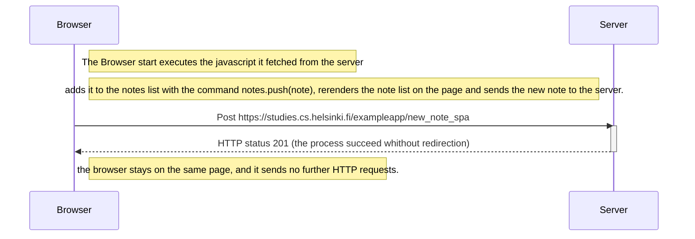

## Exercise 0.6
### this Diagram depictes the situation where the user creates a new note using the single-page version of the app.

```mermaid
  sequenceDiagram
  participant Browser
  participant Server


  Note right of Browser: The Browser start executes the javascript it fetched from the server
  Note right of Browser: adds it to the notes list with the command notes.push(note), rerenders the note list on the page and sends the new note to the server.

  Browser ->> Server: Post https://studies.cs.helsinki.fi/exampleapp/new_note_spa
  activate Server
  Server -->> Browser: HTTP status 201 (the process succeed whithout redirection)
  deactivate Server

  Note right of Browser: the browser stays on the same page, and it sends no further HTTP requests.
```
